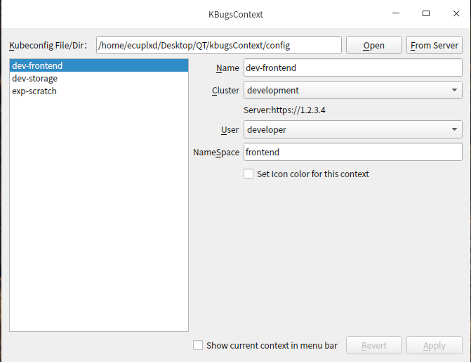
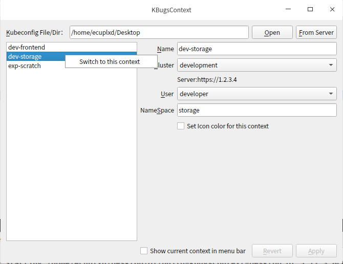
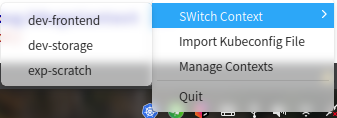

# kbugsContext

A GUI tool for switch k8s context, inspired by [KubeContext](https://github.com/turkenh/KubeContext).

## Thumbnail



## Usage

### Add kubeconfig file
There are two ways add kubeconfig file.

When first start it will parse the kubeconfig default path to loading context config(make sure the config file with ext `.config`).

You can also add config file by drag and drop a dir/file. If you drag a dir make sure the config file with ext `.config`. There is no limit for drag a file if it can parse.

### Switch Context
There are three ways to switch context.

- right click the context item



- click tray context item



- if the window is show, use `Ctrl + Tab` shortcut to select a context util the `Crtl` key release.

### Modify some config field
Click a context item, modify any field you wanted and click `Apply`. You can click `Revert` to abort you modify.

Note: not allow same name in a config file.

## Note
some function are not implemented. haha~
- [ ] Set Icon color for this context
- [x] Show current context in menu bar(Linux Only)
- [ ] Add config file from server
- [ ] Remove config item

## build

### Build Dependencies

First installed all dependent development packages(with `-dev` or `-devel`).

- cmake >= 3.1.0
- qt5-qtbase-gui >= 5.2（Debian/Ubuntu may be named `qtbase5`）
- libgtk-3
- libappindicator3


### Compile

#### GNU/Linux

```shell
mkdir build && cd build
cmake .. -DCMAKE_INSTALL_PREFIX=/usr
make -j4
sudo make install
```

#### macOS

PS: You can use [KubeContext](https://github.com/turkenh/KubeContext).

```shell
brew install qt5
brew link qt --force
echo 'export PATH="/usr/local/opt/qt/bin:$PATH"' >> ~/.bash_profile

vim ~/.bash_profile

// add to bash_profile
export PATH="/usr/local/opt/qt/bin:$PATH"
export LDFLAGS="-L/usr/local/opt/qt/lib"
export CPPFLAGS="-I/usr/local/opt/qt/include"
export PKG_CONFIG_PATH="/usr/local/opt/qt/lib/pkgconfig"


// esc and :qw save bash_profile
source ~/.bash_profile


mkdir build && cd build
cmake .. -DCMAKE_INSTALL_PREFIX=/usr/local
make
# make install TODO
```

Can run command `qmake -spec macx-xcode` to create a Xcode project.

### Winodws

didn't test.
